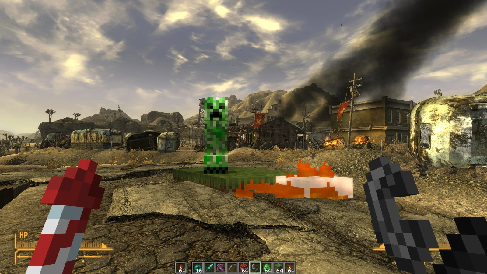
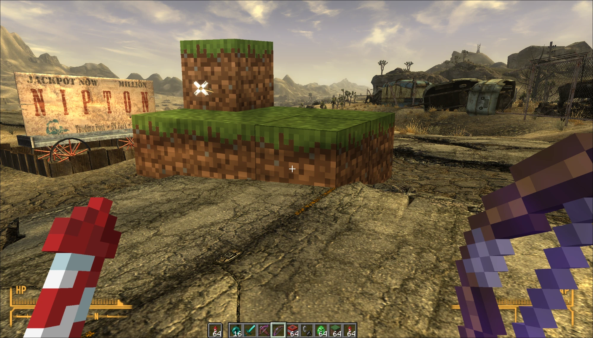

# New VegasCraft

**Minecraft Java dentro de Fallout: New Vegas.** Los dos juegos se ejecutan a la vez: la cámara de FNV mueve la de
Minecraft, el suelo de FNV se convierte en colisión invisible en Minecraft, y la imagen de Minecraft (color +
profundidad) se compone dentro de la de FNV, tapada correctamente por el terreno, las rocas y los edificios. Puedes
construir con bloques de Minecraft en el Mojave.





> ⚠️ **En desarrollo / experimental.** Solo está probado en **CachyOS** (Hyprland, Steam + Proton, AMD RX 6700 XT
> para FNV y NVIDIA RTX 5060 Ti para Minecraft). Puede cerrar el juego. Haz copia de tus partidas antes de usarlo.
> No hay binarios publicados: hay que compilarlo.

Es un mod de tipo *passthrough*, la técnica de [SkyCraft](https://github.com/chasmlol/SkyCraft) (Minecraft en
Skyrim) y del ejemplo
[minecraft-gta5-passthrough](https://github.com/rehan-remade/universal-modder/tree/main/examples/minecraft-gta5-passthrough)
de [universal-modder](https://github.com/rehan-remade/universal-modder) (Minecraft en GTA V), del que parte este
proyecto, portado a Fallout: New Vegas y a Linux.

## Estado

| | |
|---|---|
| Minecraft nativo en Linux enviando su imagen por `/dev/shm` | ✅ |
| Plugin xNVSE + add-on de ReShade (D3D9 sobre Proton/DXVK) | ✅ |
| Cámara de FNV → Minecraft (posición, orientación, FOV) | ✅ |
| Oclusión por profundidad (Minecraft detrás de rocas y edificios) | ✅ |
| Suelo de FNV como barreras en Minecraft (rayos de física Havok) | ✅ |
| Construir / romper / usar objetos (modo construcción) | ✅ |
| Ocultar Minecraft en menús de FNV | ✅ |
| **Colisión en FNV** (que los bloques paren al jugador y a los NPCs) | ⏳ pendiente |
| Teclas 1–8 sin disparar los accesos rápidos de FNV, ocultar manos/HUD de FNV | ⏳ pendiente |
| Interiores, viaje rápido, tercera persona, giros rápidos | 🧪 sin probar a fondo |

El diario completo del desarrollo (cada fallo, su causa y su arreglo) está en [MODLOG.md](MODLOG.md).

## Cómo funciona

```
Fallout: New Vegas (Proton)                              Minecraft 26.3 + Fabric (nativo, Linux)
  Data/NVSE/Plugins/vegascraft.dll                         mod "passthrough" (mc/)
    plugin xNVSE: cada frame, cámara + jugador  -- WebSocket 127.0.0.1:25599 -->  cámara, suelo, clics, hotbar
                  rayos Havok → columnas de suelo                                  (barreras invisibles)
    add-on ReShade: compositor  <-- /dev/shm/VegasCraftFrame (Z:\dev\shm\...) --  color + profundidad del mundo,
    VegasCraft.fx: test de profundidad contra FNV                                  mano + HUD aparte
```

- **Escala:** 70 unidades de FNV = 1 m = 1 bloque. FNV (x este, y norte, z arriba) → Minecraft (x, z + offset, −y).
  El suelo bajo el jugador queda en y = 64 de Minecraft; se recalcula al cargar, con F8 o tras un viaje rápido.
- **Un solo DLL** (`vegascraft.dll`, 32 bits, compilado con mingw-w64) es a la vez plugin de xNVSE y add-on de
  ReShade.
- **Memoria compartida entre Linux y Wine:** Minecraft (Java nativo) escribe un fichero en `/dev/shm`; FNV lo abre
  dentro de Wine como `Z:\dev\shm\VegasCraftFrame`. Por el espacio de direcciones de 32 bits, FNV solo mapea el frame
  que está leyendo.

## Requisitos

- Linux con Steam + Proton (probado en CachyOS con Proton Experimental).
- **Fallout: New Vegas** de Steam, versión **1.4.0.525** (la normal de Steam). Sin otros mods de ReShade/`d3d9.dll`.
- **Minecraft: Java Edition** (cuenta de Microsoft) y [Prism Launcher](https://prismlauncher.org/).
- Para compilar: `git`, `curl`, `7z`, `unzip`, **JDK 25** y **mingw-w64** (i686).
- GPU con Vulkan (DXVK). No hace falta que sean dos GPUs.

En Arch / CachyOS:

```bash
sudo pacman -S --needed git curl 7zip unzip jdk-openjdk mingw-w64-gcc
```

## Instalación paso a paso

### 1. Clonar y compilar

```bash
git clone https://github.com/Davozh/new-vegascraft.git
cd new-vegascraft
fnv/fetch_deps.sh        # descarga xNVSE, ReShade, d3dcompiler_47 y cabeceras en third_party/
fnv/build.sh             # compila fnv/build/vegascraft.dll
(cd mc && ./gradlew build)   # compila mc/build/libs/passthrough-0.1.0.jar
```

### 2. Instalar en Fallout: New Vegas

Abre FNV una vez desde Steam (para que se cree el prefijo de Proton) y ciérralo. Después:

```bash
# si FNV no está en /mnt/juegos/SteamLibrary/..., indica la carpeta del juego:
FNV_DIR="$HOME/.local/share/Steam/steamapps/common/Fallout New Vegas" fnv/install.sh
```

`install.sh` añade a la carpeta del juego: xNVSE (y pone su cargador en lugar de `FalloutNVLauncher.exe`, guardando
el original como `FalloutNVLauncher.vegascraft.exe`), ReShade como `d3d9.dll`, `d3dcompiler_47.dll`, el plugin, el
shader y la configuración de ReShade. **`fnv/install.sh --remove` lo quita todo y devuelve el launcher original.**

### 3. Opciones de lanzamiento de Steam

En Steam → Fallout: New Vegas → Propiedades → Opciones de lanzamiento:

```
WINEDLLOVERRIDES="d3d9=n,b;d3dcompiler_47=n" %command%
```

- `d3d9=n,b`: carga ReShade.
- `d3dcompiler_47=n`: usa el compilador de shaders de Microsoft; el de Proton (vkd3d) no compila lo que ReShade
  genera para D3D9 (error `E5002`).

### 4. Ajustes de FNV (obligatorios)

En `Documents/My Games/FalloutNV/` dentro del prefijo de Proton
(`steamapps/compatdata/22380/pfx/drive_c/users/steamuser/Documents/My Games/FalloutNV/`), con FNV cerrado:

```bash
cd ".../compatdata/22380/pfx/drive_c/users/steamuser/Documents/My Games/FalloutNV"
cp FalloutPrefs.ini FalloutPrefs.ini.bak
sed -i 's/^bFull Screen=1/bFull Screen=0/; s/^iMultiSample=.*/iMultiSample=0/; s/^bTransparencyMultisampling=1/bTransparencyMultisampling=0/' FalloutPrefs.ini
```

- **Sin antialiasing MSAA** (`iMultiSample=0`): con MSAA el depth buffer de FNV no se puede leer en D3D9 y los
  bloques no se ven.
- **Modo ventana** (`bFull Screen=0`): en Hyprland, a pantalla completa el ratón no funciona en FNV.

### 5. Instancia de Minecraft en Prism Launcher

1. Crea una instancia nueva: **Minecraft 26.3** con **Fabric Loader 0.19.5** (o superior para 26.3). Usa una
   instancia solo para esto: el mod cambia opciones y crea un mundo vacío llamado `passthrough`.
2. Pon en su carpeta `mods/`:
   - [Fabric API 0.161.0+26.3](https://modrinth.com/mod/fabric-api/versions?g=26.3)
   - `mc/build/libs/passthrough-0.1.0.jar`
3. Java 25 (Prism lo descarga si se lo pides).

### 6. Hyprland (recomendado)

La ventana de Minecraft debe tener la forma de la de FNV (16:9); en mosaico, Hyprland ignora el cambio de tamaño:

```
windowrulev2 = float, class:^(com\.mojang\.minecraft)$
windowrulev2 = float, class:^(steam_app_22380)$
```

## Jugar

1. Abre la instancia de Minecraft en Prism. Espera a que entre sola en el mundo `passthrough` y **déjala abierta,
   sin minimizar**.
2. Abre FNV desde Steam y carga una partida en un exterior.
3. Al conectar, el plugin nivela el suelo y empieza a mandarlo a Minecraft.

| Tecla | Acción |
|---|---|
| **B** | Modo construcción sí/no. En él, el ratón es de Minecraft y FNV no ataca |
| Clic izquierdo / derecho | (modo construcción) romper / poner bloque, atacar / usar |
| 1–9 | (modo construcción) barra de objetos de Minecraft |
| F7 | Passthrough sí/no |
| F8 | Volver a nivelar el suelo donde estás |
| F10 | Escribe el estado de la cámara en `vegascraft.log` (carpeta del juego) |
| F11 | Vistas de depuración del shader (profundidad FNV, profundidad Minecraft, diferencia) |

No uses **F9** para nada de esto: en FNV es la carga rápida.

## Problemas conocidos

- Los bloques **todavía no tienen colisión en FNV**: los atraviesas.
- Las teclas 1–8 también disparan tus accesos rápidos de FNV.
- Se ven a la vez las manos de FNV y las de Steve, y el HUD de ambos.
- Si FNV se cierra al cargar, mira `vegascraft.log` y `falloutnv_error.log` en la carpeta del juego.
- El enlace WebSocket escucha en `127.0.0.1:25599` sin autenticación: cualquier programa local puede mandarle
  comandos. Cierra Minecraft al terminar.

## Estructura

| Ruta | Qué es |
|---|---|
| `fnv/src/plugin.cpp` | plugin xNVSE: cámara, nivelado, muestreo del suelo, modo construcción, teclas |
| `fnv/src/fnv_game.h` | direcciones y estructuras del motor de FNV 1.4.0.525 (cámara, jugador, rayos Havok, menús) |
| `fnv/src/compositor.cpp` | add-on de ReShade: lee los frames de `/dev/shm` y los sube al shader |
| `fnv/shaders/VegasCraft.fx` | composición: test de profundidad, reproyección, luz, bruma |
| `fnv/fetch_deps.sh`, `build.sh`, `install.sh` | dependencias, compilación con mingw, instalación / desinstalación |
| `mc/` | mod de Fabric (Java 25): enlace WebSocket, exportación de frames, barreras, bloques |
| `host/` | pruebas sin FNV (`fakehost.py` mueve la cámara de Minecraft y compone sobre una escena sintética) |
| `MODLOG.md` | diario del desarrollo |

## Créditos

- [universal-modder](https://github.com/rehan-remade/universal-modder) (MIT): el ejemplo Minecraft × GTA V del que
  salen el mod de Fabric, el compositor, el shader y las pruebas.
- [chasm / SkyCraft](https://github.com/chasmlol/SkyCraft): la idea del passthrough.
- [xNVSE](https://github.com/xNVSE/NVSE) y [JIP LN NVSE](https://github.com/jazzisparis/JIP-LN-NVSE): las direcciones y
  estructuras del motor de FNV se tomaron como referencia de sus cabeceras (no se copia su código).
- [ReShade](https://reshade.me) y su API de add-ons, de crosire. [Fabric](https://fabricmc.net).
- Hecho con ayuda de Claude Code.

Proyecto de fans sin relación con Bethesda, Obsidian, Microsoft ni Mojang. No incluye ni redistribuye archivos de
ninguno de los dos juegos.

## Licencia

[MIT](LICENSE).
